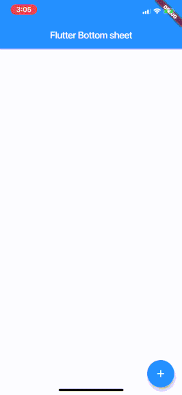

# flutter_pin_code

A simple material design pin code view for flutter apps. Pull requests are always welcome.

## Installation

#### 1. Depend on it
Add this to your package's pubspec.yaml file:

```
dependencies:
  flutter_pin_code: ^1.0.0
```

#### 2. Install it
You can install packages from the command line:

with pub:

```
$ pub get
```

with Flutter:

```
$ flutter pub get
```

Alternatively, your editor might support pub get or flutter pub get. Check the docs for your editor to learn more.

#### 3.Import it Now in your Dart code, you can use:

```
import 'package:flutter_pin_code/flutter_pin_code.dart';
```

## Usage

```dart
import 'package:flutter_pin_code/flutter_pin_code.dart';

class MyWidget extends StatelessWidget {
  Widget build(BuildContext context) {
    return PinCodeView(
       correctPin: 555555,
       title: Text(
         'Please input PIN to continue',
         style: TextStyle(color: Colors.blue),
         textAlign: TextAlign.center,
       ),
       subTitle: InkWell(
         onTap: () {},
         child: Text(
           'Forgot PIN?',
           style: TextStyle(color: Colors.blue),
           textAlign: TextAlign.center,
         ),
       ),
       errorMsg: 'Wrong PIN',
       onSuccess: (pin) {
         Navigator.pop(context);
         _showSnackBar(pin);
       },
     );
  }
}
```

